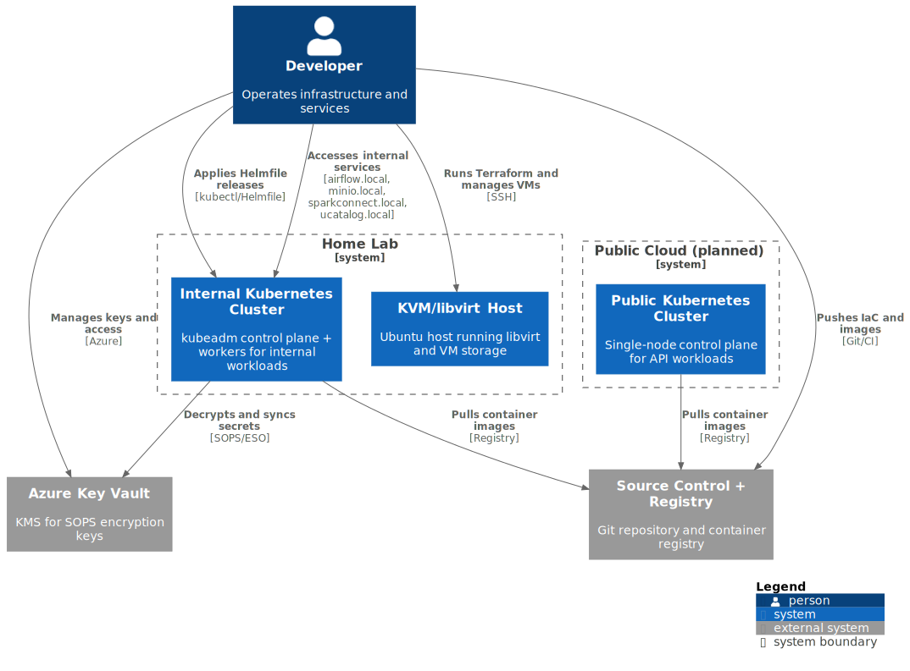
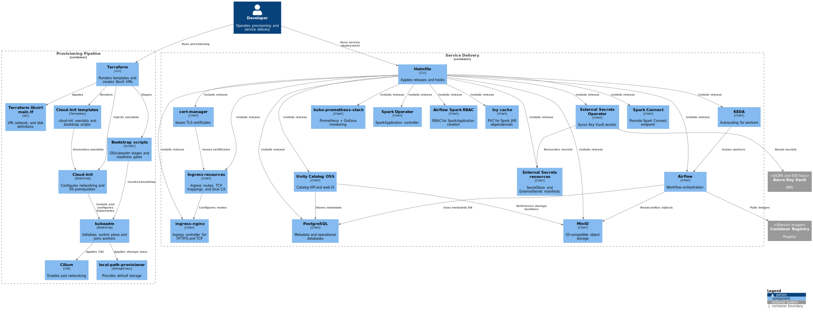

# Architecture Documentation

## Overview
C4-like documentation for a home-lab Kubernetes deployment that supports data engineering work. The diagrams explain how the VM fleet is provisioned, how the cluster is bootstrapped, and how core services are deployed and interact inside the platform.

## Diagram inventory
| View | Focus | Source | Rendered Output |
| --- | --- | --- | --- |
| System Context | Developer, key external systems, and the home-lab/public cluster boundaries | [`docs/diagrams/context.puml`](diagrams/context.puml) | `docs/images/Context.svg` |
| Internal Cluster Containers | Core infrastructure and runtime services within the home-lab cluster | [`docs/diagrams/Internal-Cluster-Containers.puml`](diagrams/Internal-Cluster-Containers.puml) | `docs/images/Internal-Cluster-Containers.svg` |
| Deployment Workflow | Terraform + Cloud-Init + kubeadm provisioning, followed by Helmfile services | [`docs/diagrams/workflow.puml`](diagrams/workflow.puml) | `docs/images/Workflow.svg` |

## Diagrams

## Rendering
`.github/workflows/render-diagrams.yml` renders any updated `.puml` files in CI. When a pull request or push touches `docs/diagrams/**`, the workflow:
1. Installs Java, Graphviz, and PlantUML.
2. Generates SVGs inside `docs/images`.
3. Commits the refreshed diagrams back to the branch via `git-auto-commit-action`.

If working locally, run PlantUML against the `.puml` files and export SVGs to `docs/images`.
